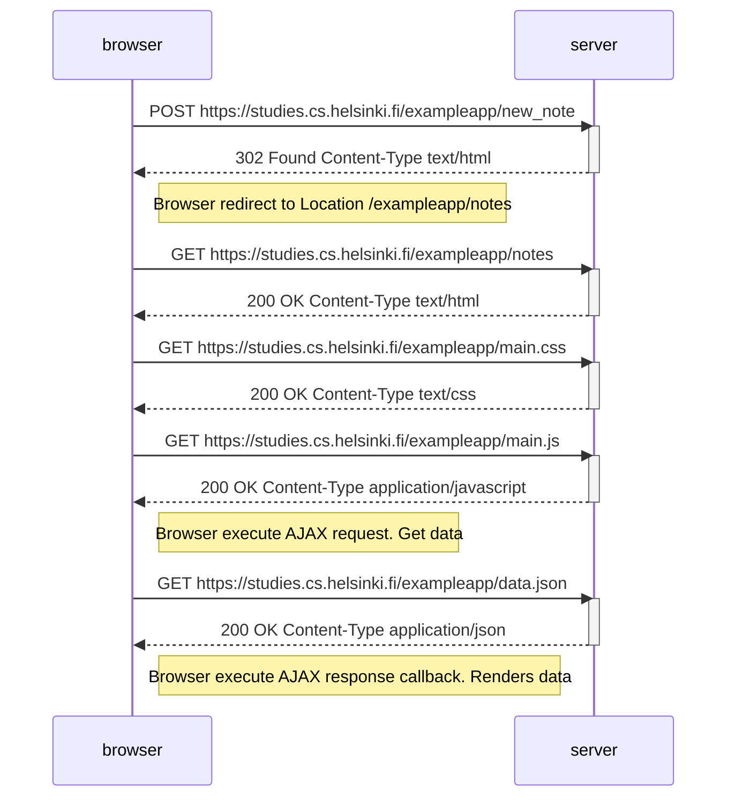

### New Note Using Form Post Redirect 
Diagram illustrates the sequence of calls made when a user submits a new note on [/exampleapp/notes](https://studies.cs.helsinki.fi/exampleapp/notes)

```mermaid
sequenceDiagram
    participant browser
    participant server

    browser->>server: POST https://studies.cs.helsinki.fi/exampleapp/new_note
    activate server
    server-->>browser: 302 Found Content-Type text/html
    deactivate server
    Note right of browser: Browser redirect to Location /exampleapp/notes
    
    browser->>server: GET https://studies.cs.helsinki.fi/exampleapp/notes
    activate server
    server-->>browser: 200 OK Content-Type text/html
    deactivate server

    browser->>server: GET https://studies.cs.helsinki.fi/exampleapp/main.css
    activate server
    server-->>browser: 200 OK Content-Type text/css
    deactivate server

    browser->>server: GET https://studies.cs.helsinki.fi/exampleapp/main.js
    activate server
    server-->>browser: 200 OK Content-Type application/javascript
    deactivate server
    Note right of browser: Browser execute AJAX request. Get data
    
    browser->>server: GET https://studies.cs.helsinki.fi/exampleapp/data.json
    activate server
    server-->>browser: 200 OK Content-Type application/json
    deactivate server
    Note right of browser: Browser execute AJAX response callback. Renders data
```
