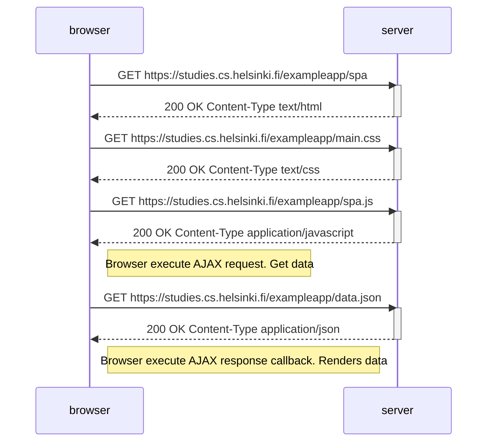

### Browser Loads SPA
Diagram illustrates the sequence of calls made when a browser loads the single page app [/exampleapp/spa](https://studies.cs.helsinki.fi/exampleapp/spa)

```mermaid
sequenceDiagram
    participant browser
    participant server

    browser->>server: GET https://studies.cs.helsinki.fi/exampleapp/spa
    activate server
    server-->>browser: 200 OK Content-Type text/html
    deactivate server

    browser->>server: GET https://studies.cs.helsinki.fi/exampleapp/main.css
    activate server
    server-->>browser: 200 OK Content-Type text/css
    deactivate server

    browser->>server: GET https://studies.cs.helsinki.fi/exampleapp/spa.js
    activate server
    server-->>browser: 200 OK Content-Type application/javascript
    deactivate server
    Note right of browser: Browser execute AJAX request. Get data
    
    browser->>server: GET https://studies.cs.helsinki.fi/exampleapp/data.json
    activate server
    server-->>browser: 200 OK Content-Type application/json
    deactivate server
    Note right of browser: Browser execute AJAX response callback. Renders data
```