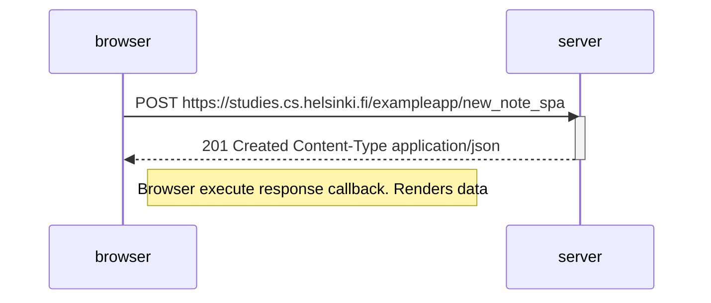

### New Note Using SPA
Diagram illustrates the sequence of calls made when a user creates a new note on the single page app [/exampleapp/spa](https://studies.cs.helsinki.fi/exampleapp/spa)

```mermaid
sequenceDiagram
    participant browser
    participant server

    browser->>server: POST https://studies.cs.helsinki.fi/exampleapp/new_note_spa
    activate server
    server-->>browser: 201 Created Content-Type application/json
    deactivate server
    Note right of browser: Browser execute response callback. Renders data
```